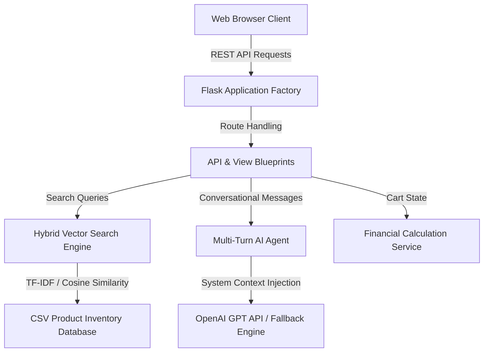

# SwiftShop – Enterprise AI Retail & E-Commerce Platform

[](https://www.python.org/)
[](https://flask.palletsprojects.com/)
[]()
[]()
[](https://www.docker.com/)

**SwiftShop** is an enterprise-grade, intelligent AI shopping platform and real-time retail navigation engine. Designed with a modular service architecture, hybrid vector TF-IDF RAG search, multi-turn AI tool execution, automated test coverage, and a production glassmorphism web interface.

---

## Key Features & Production Highlights

- **Hybrid Semantic & Vector Search Engine (RAG)**: Integrates TF-IDF Vector Cosine Similarity with lexical token matching and intent parsing (regex price extraction, aisle constraints, and stock status filtering).
- **Conversational AI Agent**: Multi-turn session memory with OpenAI Function Calling fallback capabilities.
- **Production Cart & Checkout Engine**: Backend API cart calculation (`/api/cart/calculate`) handling GST/tax, subtotal, delivery fee tiers, and real-time quantity state management.
- **Live Search Autocomplete**: Asynchronous client-side autocomplete with zero-latency visual feedback.
- **Modular Layered Architecture**: Strict separation of concerns (Application Factory, Service Layer, Dataclass Models, Flask Blueprints).
- **Comprehensive Automated Test Suite**: Built-in `unittest` suite covering search precision, API contracts, and financial calculation correctness.
- **Containerized Deployment**: Ready for cloud deployment via `Dockerfile` and `docker-compose.yml`.

---

## System Architecture



---

## Project Structure

```
swift_app/
├── backend/
│   ├── app.py                  # Flask Application Factory & Error Handlers
│   ├── config.py               # Centralized configuration & environment settings
│   ├── models/
│   │   └── product.py          # Dataclass models (Product, SearchFilter, CartItem)
│   ├── routes/
│   │   ├── api_routes.py       # REST API Endpoints (/api/products, /api/chat, /api/cart)
│   │   └── view_routes.py      # HTML View Renderers
│   └── services/
│       ├── search_service.py   # TF-IDF Vector Cosine Similarity Search Engine
│       └── ai_agent_service.py # Multi-turn AI Agent & Tool Execution
├── tests/
│   ├── test_search.py          # Unit tests for Vector Search & Intent Parser
│   └── test_api.py             # Integration tests for REST Endpoints & Cart API
├── static/
│   ├── styles.css              # Glassmorphism Design System & CSS custom properties
│   └── script.js               # Async Cart state, Search Autocomplete, Drawer UI
├── templates/                  # Responsive HTML5 Templates (index, chatbot, trending, map)
├── products.csv                # Inventory dataset (20+ realistic products)
├── Dockerfile                  # Container build configuration
├── docker-compose.yml          # Container orchestration definition
└── README.md                   # Enterprise technical documentation
```

---

## REST API Specification

| Endpoint | Method | Description | Sample Query Params / Payload |
| :--- | :--- | :--- | :--- |
| `/api/products` | `GET` | Fetch all products or filter catalog | `?q=dettol&category=Hygiene&max_price=200` |
| `/api/products/<id>` | `GET` | Get detailed product specifications | N/A |
| `/api/chat` | `POST` | Multi-turn conversational AI interaction | `{"session_id": "...", "message": "Snacks under 50"}` |
| `/api/cart/calculate` | `POST` | Compute cart subtotal, GST, and grand total | `{"items": [{"name": "Dettol", "price": 99, "quantity": 2}]}` |

---

## Getting Started

### Local Development Setup

1. **Clone the Repository**:
   ```bash
   git clone https://github.com/Tanvee1/swift_app.git
   cd swift_app
   ```

2. **Install Dependencies**:
   ```bash
   pip install -r requirements.txt
   ```

3. **Run Application**:
   ```bash
   python3 app.py
   ```
   Open `http://localhost:8080` in your web browser.

---

## Automated Test Suite

Run the automated unit and integration tests:
```bash
python3 -m unittest discover -s tests -p "test_*.py"
```

---

## Docker Deployment

Build and run using Docker Compose:
```bash
docker-compose up --build
```