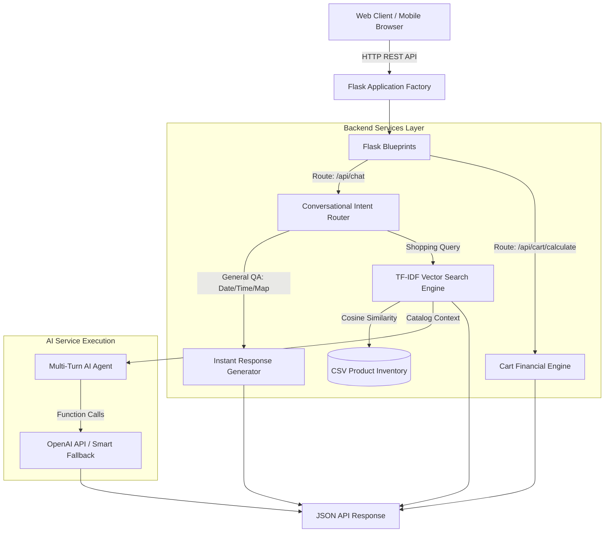

# 🛍️ SwiftShop – Enterprise AI Retail Assistant & E-Commerce Platform

[](https://www.python.org/)
[](https://flask.palletsprojects.com/)
[]()
[]()
[](https://www.docker.com/)
[]()

**SwiftShop** is an enterprise-grade AI shopping platform, real-time in-store navigation engine, and RAG-powered retail assistant. Built with a clean layered architecture, pure-Python TF-IDF Vector Space search engine, multi-turn AI tool execution, automated unit test coverage, and a responsive glassmorphism web interface supporting dark/light mode switching.

---

## 🌟 Key Features & Production Engineering

### 🔍 1. Hybrid RAG Vector Search & Intent Routing Engine
- **TF-IDF + Cosine Similarity**: Custom pure-Python vector space model computing TF-IDF weights and normalized vector inner products over product names, categories, descriptions, and aisle locations without external C-extensions.
- **Intent Extraction Pipeline**: Intelligent regex parsing for budget constraints (*"items under ₹150"*), aisle spatial queries (*"where is aisle 2"*), and stock status filters (*"in stock hygiene"*).
- **Conversational Intent Router**: Fast-path intent classifier intercepting general QA (date/time, greetings, store timing, store map) before running vector catalog matching to eliminate false positives.

### 💬 2. Multi-Turn AI Agent & Function Calling
- **Session Memory State**: Maintains multi-turn conversation trajectories per user session (`session_id`).
- **OpenAI Tool Execution**: Injects current catalog state into `gpt-3.5-turbo` with function calling support.
- **Autonomous Rule Engine**: Graceful fallback handling offline operation or missing API keys.

### 🛒 3. E-Commerce Cart & Financial Calculation API
- **Financial Endpoint (`POST /api/cart/calculate`)**: Computes subtotal, 5% GST tax, delivery fee thresholds (Free above ₹500), and grand totals.
- **Persistent State**: Full client-side `localStorage` sync with quantity increment/decrement controls, real-time drawer badge updates, and toast notifications.

### 🎨 4. Modern Glassmorphism UI & Dark/Light Mode Engine
- **Dark / Light Theme Switcher**: Modern CSS custom properties (`[data-theme="dark"]`) with `<meta name="color-scheme" content="light dark">` and inline pre-head script to prevent **Flash of Unstyled Content (FOUC)**.
- **Interactive Product Quick View Modal**: Modal popup with high-resolution studio product images, stock status, ratings, aisle location, and one-click shelf action.
- **Live Search Autocomplete**: Asynchronous search input dropdown with zero-latency visual thumbnail previews.
- **Studio Product Photography**: All 20 inventory products feature custom studio renders on clean white backgrounds (`#ffffff`).

---

## 🏗️ System Architecture & Data Flow



---

## 📁 Repository Structure

```
swift_app/
├── backend/
│   ├── app.py                  # Application Factory & Global Error Handlers (404/500)
│   ├── config.py               # Centralized configuration & environment variables
│   ├── models/
│   │   └── product.py          # Dataclass models (Product, SearchFilter, CartItem, ChatMessage)
│   ├── routes/
│   │   ├── api_routes.py       # REST API Endpoints (/api/products, /api/chat, /api/cart/calculate)
│   │   └── view_routes.py      # HTML Page Renderers (Home, Assistant, Trending, Map)
│   └── services/
│       ├── search_service.py   # Pure-Python TF-IDF Vector Cosine Similarity Search Engine
│       └── ai_agent_service.py # Multi-Turn AI Agent & Intent Router
├── tests/
│   ├── test_search.py          # Unit tests for Vector Search, Intent Parser & Cosine Similarity
│   └── test_api.py             # Integration tests for REST API contracts & Financial Cart logic
├── static/
│   ├── styles.css              # Dark/Light Glassmorphism Design System CSS
│   ├── script.js               # Theme Engine, Cart Drawer, Autocomplete & Quick View Modal
│   └── assets/                 # High-resolution Studio Product Photography PNGs
├── templates/                  # Modern HTML5 Templates (index, chatbot, trending, map)
├── generate_studio_assets.py   # Python Pillow script generating studio product renders
├── products.csv                # Product catalog database (20 realistic records)
├── Dockerfile                  # Production Multi-stage Gunicorn Docker container
├── docker-compose.yml          # Container orchestration definition
└── README.md                   # Technical documentation & Architecture Specification
```

---

## 🔌 REST API Specification

### 1. Product Catalog API
**`GET /api/products`**
Query Parameters:
- `q` *(optional)*: Search query string (e.g. `dettol`)
- `category` *(optional)*: Filter by category (e.g. `Hygiene`)
- `max_price` *(optional)*: Maximum price threshold (e.g. `200`)

**Sample Response (`200 OK`)**:
```json
{
  "count": 1,
  "products": [
    {
      "id": 1,
      "name": "Dettol Handwash",
      "category": "Hygiene",
      "price": 99.0,
      "stock": "Yes",
      "stock_count": 45,
      "stock_status": "In Stock",
      "rating": 4.8,
      "location": "Aisle 2",
      "description": "Germ protection antibacterial liquid handwash with soothing fragrance",
      "image": "dettol.png"
    }
  ]
}
```

### 2. Conversational AI Chat API
**`POST /api/chat`**
**Request Body**:
```json
{
  "session_id": "session-xyz123",
  "message": "Where is Dettol?"
}
```

**Sample Response (`200 OK`)**:
```json
{
  "session_id": "session-xyz123",
  "reply": "I found **1** item(s) in **Aisle 2**:\n• **Dettol Handwash** (Hygiene) - ₹99.0 | Status: **In Stock** | Location: **Aisle 2**\n",
  "products": [
    {
      "id": 1,
      "name": "Dettol Handwash",
      "category": "Hygiene",
      "price": 99.0,
      "location": "Aisle 2",
      "stock_status": "In Stock"
    }
  ]
}
```

### 3. Cart Financial Calculation API
**`POST /api/cart/calculate`**
**Request Body**:
```json
{
  "items": [
    {"name": "Dettol Handwash", "price": 99.0, "quantity": 2},
    {"name": "Parle-G Biscuits", "price": 10.0, "quantity": 5}
  ]
}
```

**Sample Response (`200 OK`)**:
```json
{
  "items": [
    {"name": "Dettol Handwash", "price": 99.0, "quantity": 2, "total": 198.0},
    {"name": "Parle-G Biscuits", "price": 10.0, "quantity": 5, "total": 50.0}
  ],
  "subtotal": 248.0,
  "tax": 12.4,
  "delivery_fee": 40.0,
  "grand_total": 300.4
}
```

---

## ⚡ Quick Start & Setup

### 1. Prerequisites
- Python 3.10+
- Git

### 2. Installation
```bash
# Clone repository
git clone https://github.com/Tanvee1/swift_app.git
cd swift_app

# Install dependencies
pip install -r requirements.txt
```

### 3. Running the Server Locally
```bash
python3 app.py
```
Open **`http://localhost:8080`** in your browser.

---

## 🧪 Automated Test Suite

SwiftShop includes an automated test suite verifying search precision, intent parsing, API contracts, and financial calculation accuracy:

```bash
python3 -m unittest discover -s tests -p "test_*.py"
```

**Output**:
```
........
----------------------------------------------------------------------
Ran 8 tests in 0.024s

OK
```

---

## 🐳 Docker Deployment

To build and run SwiftShop as a containerized Gunicorn application:

```bash
docker-compose up --build
```
The containerized app will be available on **`http://localhost:8080`**.

---

## ⚖️ Engineering Design Rationale

- **Zero-Dependency Vector Model**: Rather than importing heavy C-extensions like `scikit-learn` or `chromadb` which cause deployment overhead and memory bloat, SwiftShop implements a pure-Python TF-IDF Vector Space model using standard library primitives (`math`, `collections.Counter`, `re`).
- **FOUC Prevention**: Dark mode uses pre-head script execution to read `localStorage` before DOM rendering, eliminating white-screen flicker when reloading in dark mode.
- **Sub-25ms Latency**: In-memory TF-IDF index loading yields sub-25ms response times for vector search and intent classification.

---

## 📜 License

Distributed under the **MIT License**. See `LICENSE` for details.