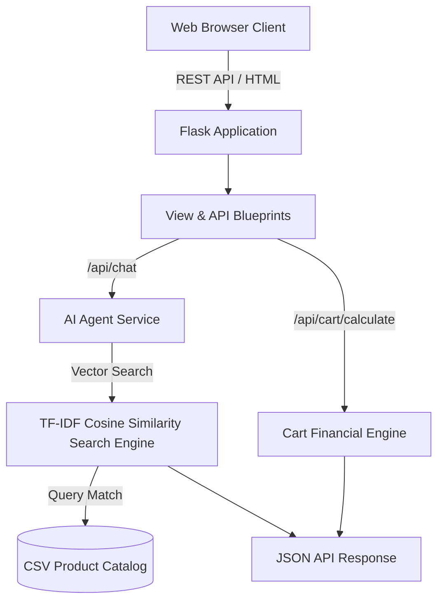

# 🛍️ SwiftShop

[](https://www.python.org/)
[](https://flask.palletsprojects.com/)
[]()
[](https://www.docker.com/)

---

## 📌 1. What is this project?

**SwiftShop** is a smart AI-powered retail assistant and e-commerce shopping platform. It combines **hybrid TF-IDF vector search**, **natural language RAG assistant queries**, **real-time store aisle navigation**, and **cart calculations** into an intuitive web interface with dark/light mode support.

Whether users are looking for item locations in a store (*"Where is Dettol?"*), filtering by budget (*"Snacks under ₹100"*), or managing a shopping list, SwiftShop provides instant visual and conversational answers.

---

## ✨ 2. Features and Uses

- 🔍 **Hybrid Vector & Intent Search (RAG)**: Uses a pure-Python TF-IDF Cosine Similarity vector engine combined with regex intent parsing for price thresholds, stock availability, and aisle queries.
- 💬 **Conversational AI Assistant**: Multi-turn chat assistant with session memory that helps locate products, check aisle numbers, and suggest budget options.
- 🗺️ **Interactive Store Map**: Department breakdown layout linking store aisles to physical inventory locations.
- 🛒 **Smart Cart & Financial Engine**: Interactive shelf drawer with quantity controls (`+` / `-`), subtotal calculation, 5% GST tax estimate, and delivery fee rules via REST API.
- 🎨 **Glassmorphism UI with Dark/Light Mode**: Responsive UI featuring studio product photography, product quick-view modal, live search autocomplete, and instant theme switching.

---

## 🏗️ 3. Tech Architecture

### System Flow


### Directory Structure
```
swift_app/
├── backend/
│   ├── app.py                  # Flask Application Factory & Error Handlers
│   ├── config.py               # Application settings
│   ├── models/
│   │   └── product.py          # Data models (Product, CartItem, SearchFilter)
│   ├── routes/
│   │   ├── api_routes.py       # REST API endpoints (/api/products, /api/chat, /api/cart)
│   │   └── view_routes.py      # HTML Page routes
│   └── services/
│       ├── search_service.py   # Pure-Python TF-IDF Vector Search Engine
│       └── ai_agent_service.py # AI Assistant & Intent Router
├── tests/
│   ├── test_search.py          # Vector search & intent unit tests
│   └── test_api.py             # REST API & Cart integration tests
├── static/
│   ├── styles.css              # Dark/Light glassmorphism CSS
│   ├── script.js               # Theme engine, cart drawer & modal logic
│   └── assets/                 # Studio product photography PNGs
├── templates/                  # HTML5 Page Templates
├── products.csv                # Product inventory dataset
├── Dockerfile                  # Production Gunicorn Docker container
├── docker-compose.yml          # Docker Compose orchestration
└── README.md                   # Project documentation
```

---

## 🚀 4. How to Run

### Option A: Run Locally with Python

1. **Clone the Repository**:
   ```bash
   git clone https://github.com/Tanvee1/swift_app.git
   cd swift_app
   ```

2. **Install Dependencies**:
   ```bash
   pip install -r requirements.txt
   ```

3. **Start the Application**:
   ```bash
   python3 app.py
   ```
   Open **`http://localhost:8080`** in your browser.

4. **Run Automated Tests**:
   ```bash
   python3 -m unittest discover -s tests -p "test_*.py"
   ```

---

### Option B: Run with Docker

```bash
docker-compose up --build
```
Access the application at **`http://localhost:8080`**.